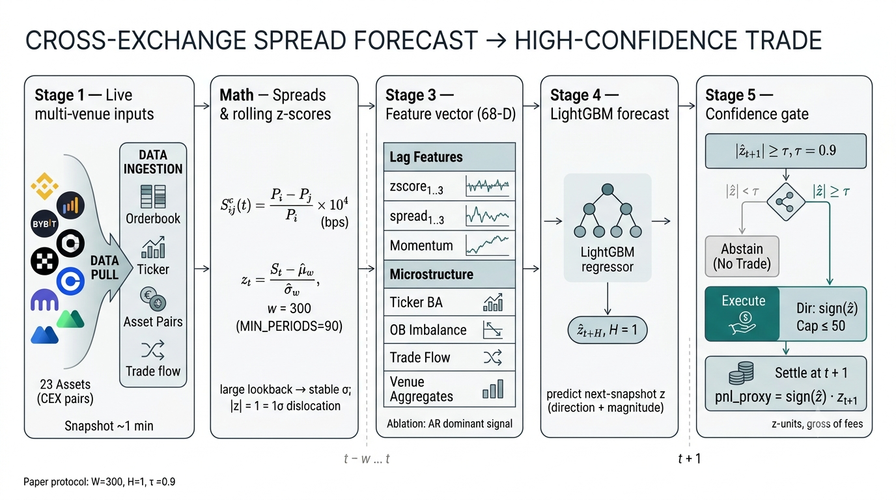

# Stochastic Spread Modeling

**Stochastic Spread Modeling for Cross-Venue Cryptocurrency Trading: An Ornstein–Uhlenbeck Framework on High-Frequency OHLCV Data**

Kevin Litvin, Tania Pocrnjic — Simon Fraser University
*ICAIF '26 — 7th ACM International Conference on AI in Finance · Milan, Italy · November 2026*

[Paper source](paper/stochastic-cross-venue-ohlcv-trading.tex) · [Citation](#citation)

<p align="center">
  
</p>
<p align="center"><sub><b>Figure 1.</b> End-to-end pipeline: multi-venue data ingestion → spread/rolling z-score computation → 68-D feature vector → LightGBM forecast → confidence-gated trade execution.</sub></p>

## Abstract

Cross-exchange price deviations in cryptocurrency markets have been widely documented, yet few studies build and evaluate systematic trading strategies that exploit them. We model the price spread of identical assets across centralized exchanges as an Ornstein–Uhlenbeck (OU) process and trade when deviations exceed a calibrated threshold. Across 30 days of 1-minute OHLCV data (5 assets, 7 exchanges, 50 exchange-pair–model combinations), OU-based mean-reversion is profitable exactly when an asset's cross-exchange spread volatility exceeds the round-trip fee (WIF, PEPE, CRV) and uniformly unprofitable otherwise (DOGE, SOL). The effect traces back to structural price latency on specific exchanges (e.g. a 38-minute lag on Crypto.com for CRV). The OU model consistently beats a rolling z-score baseline on Sharpe ratio and win rate.

## Overview

The system models cross-exchange price spreads as Ornstein–Uhlenbeck processes, estimates mean-reversion parameters online, and generates trading signals when z-scores breach configurable thresholds. It supports 12 exchanges (Binance, Kraken, KuCoin, Bybit, OKX, Gate.io, etc.) via [ccxt](https://github.com/ccxt/ccxt) and runs on 1-minute OHLCV candles.

### Project Structure

```
├── experiments/
│   ├── paper_trader.py          # Live paper trading with WebSocket feeds
│   ├── backtest_historical.py   # Historical backtester on Parquet data
│   ├── download_historical_ohlcv.py
│   ├── robustness_test.py       # ADF tests, rolling window stability
│   ├── train_spread_model.py    # ML spread predictor (LightGBM)
│   └── ...
├── cpp/
│   ├── signal_engine.cpp        # C++ signal computation (pybind11)
│   └── ANALYSIS.md              # Profiling rationale for C++ port
├── benchmarks/
│   └── bench_signal_engine.py   # Python vs C++ benchmark harness
├── scripts/
│   ├── data.py                  # Exchange configs and coin universe
│   └── fees.py                  # Per-exchange taker fee schedule
├── tests/
│   └── test_core.py
├── paper/                       # LaTeX source (ACM acmart sigconf)
├── setup.py                     # C++ extension build script
└── requirements.txt
```

## Setup

### Python Dependencies

```bash
python -m venv venv
source venv/bin/activate   # Linux/macOS
venv\Scripts\activate      # Windows

pip install -r requirements.txt
```

### Notebooks (no outputs in git)

All `*.ipynb` files are committed **code-only** (outputs stripped). After cloning:

```bash
pip install nbstripout pre-commit
nbstripout --install          # git filter for *.ipynb
pre-commit install            # also strips on commit via .pre-commit-config.yaml
```

### C++ Signal Engine (Optional)

The hot-path signal functions have C++ implementations that provide **160–200× speedup** over NumPy for batch operations. The C++ module is optional — all Python code falls back to NumPy implementations if it is not compiled.

#### Prerequisites

You need a C++17 compiler and Python development headers:

| OS      | Compiler | Install                                                                 |
|---------|----------|-------------------------------------------------------------------------|
| Windows | MSVC     | [Visual Studio Build Tools](https://visualstudio.microsoft.com/visual-cpp-build-tools/) — select "Desktop development with C++" |
| macOS   | Clang    | `xcode-select --install`                                                |
| Linux   | GCC      | `sudo apt install build-essential python3-dev` (Debian/Ubuntu)          |

#### Build

```bash
pip install pybind11
python setup.py build_ext --inplace
```

This compiles `cpp/signal_engine.cpp` and produces a shared library in the project root:
- **Windows**: `signal_engine.cp3XX-win_amd64.pyd`
- **macOS**: `signal_engine.cpython-3XX-darwin.so`
- **Linux**: `signal_engine.cpython-3XX-x86_64-linux-gnu.so`

#### Verify

```bash
python -c "import signal_engine; print('C++ engine loaded')"
```

## Usage

### Historical Backtesting

```bash
# Download 30 days of 1-min OHLCV data
python experiments/download_historical_ohlcv.py

# Run backtest (all assets)
python experiments/backtest_historical.py

# Specific asset with custom parameters
python experiments/backtest_historical.py --asset CRV --entry-z 1.5 --exit-z 0.3 --window 60
```

### Live Paper Trading

```bash
python experiments/paper_trader.py --asset WIF --exchanges binance,cryptocom --strategy ou
```

Press Ctrl+C to stop. Results are saved to `data/paper_trading/`.

### Long-Run Data Collection

Use the stat-arb collector to build a multi-signal dataset for research and model training:

```bash
# 7-day run, 60s cadence, slow signals every 10 snapshots
python -m experiments.collect_statarb_data --assets volatile --interval 60 --slow-every 10 --hours 168
```

Useful flags:
- `--skip-ohlcv`: disable OHLCV pulls when you want lighter network/API load.
- `--hours`: total run duration (e.g. `0.5` for 30 minutes).
- `--slow-every`: controls how often slow signals are fetched (higher = less frequent).

Output is written under `data/statarb/<run_timestamp>/` and partitioned by UTC day per signal.

#### Unattended multi-day runs (Windows)

For runs longer than a few hours, launch detached so it survives the terminal closing:

```powershell
Start-Process -FilePath python -ArgumentList "-m","experiments.collect_statarb_data","--assets","volatile","--interval","60","--slow-every","10","--hours","60" `
  -WorkingDirectory "<repo-path>" -WindowStyle Hidden `
  -RedirectStandardOutput "data\statarb\collector_console.log" `
  -RedirectStandardError "data\statarb\collector_console_err.log"
```

Also disable sleep/hibernate first (`powercfg /change standby-timeout-ac 0`, same for `-dc`, `hibernate-timeout-ac`, `hibernate-timeout-dc`) — Windows sleep was the single biggest cause of data gaps in earlier runs. Verify it's alive with `Get-Process python` and `Get-Content data\statarb\collector_console.log -Tail 10`.

### Benchmarks

```bash
python benchmarks/bench_signal_engine.py
```

Sample results (AMD Ryzen 7, Python 3.13):

| Function            | Python (NumPy) | C++     | Speedup |
|---------------------|---------------|---------|---------|
| `estimate_ou_params`| 32.1 μs       | 1.3 μs  | 25×     |
| `ou_zscore`         | 39.2 μs       | 1.0 μs  | 38×     |
| `batch_ou_signals`  | 1,520 ms      | 7.7 ms  | 196×    |
| `backtest_engine`   | 1,860 ms      | 8.9 ms  | 209×    |

### Tests

```bash
pytest tests/
```

## Citation

```bibtex
@inproceedings{litvin2026stochastic,
  title     = {Stochastic Spread Modeling for Cross-Venue Cryptocurrency Trading: An Ornstein--Uhlenbeck Framework on High-Frequency OHLCV Data},
  author    = {Litvin, Kevin and Pocrnjic, Tania},
  booktitle = {Proceedings of the 7th ACM International Conference on AI in Finance (ICAIF '26)},
  year      = {2026},
  address   = {Milan, Italy}
}
```

## License

Research code — not licensed for production trading use.
