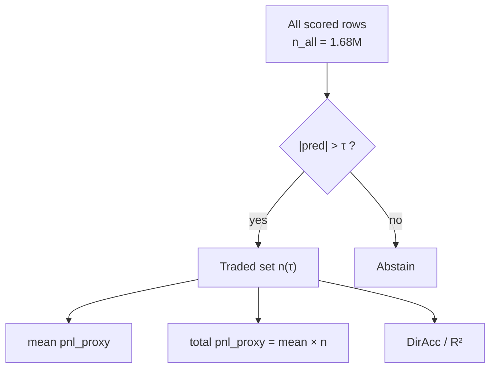
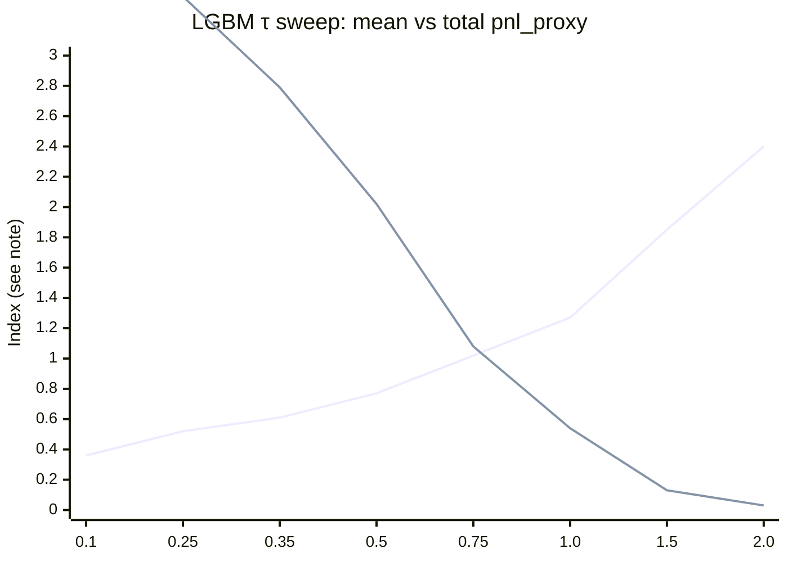

# LightGBM `|pred| > τ` Filter Ablation

**Use in paper:** Methods (abstention filter) · Results (sensitivity table/figure) · Discussion (why τ=0.5)  
**Holdout:** Jul 25–28 offline · **Model:** `statarb/outputs/statarb_lgbm.txt` (not retrained)  
**Runner / data:** [`statarb/sweep_lgbm_pred_tau.py`](../statarb/sweep_lgbm_pred_tau.py) → [`statarb/outputs_lgbm_tau_sweep_jul25/`](../statarb/outputs_lgbm_tau_sweep_jul25/) (`tau_sweep.csv` / `.json`)

---

## What to use where

| Paper section | Claim / content | Copy from |
|---|---|---|
| **Methods** | Trade when `\|pred\| > τ`; τ=0.5 is the protocol default | §Definitions |
| **Results** | Raising τ improves *per-trade* DirAcc / R² / mean pnl_proxy | Headline table |
| **Results** | Total z-proxy mass = mean × n (does **not** penalize fire rate) | §Total pnl |
| **Discussion** | Keep τ=0.5 for live parity + strong skill vs naive | §Takeaway |
| *Appendix* | Full τ grid | `tau_sweep.csv` |

**Primary paper metrics:** DirAcc, R², mean `pnl_proxy`, and **total pnl_proxy** (`mean × n`).  
We do **not** use a fire-rate composite score.

---

## Definitions

| Term | Meaning |
|---|---|
| n | traded rows with `\|pred\| > τ` |
| DirAcc | `sign(pred) == sign(z_{t+1})` on traded rows (zeros excluded) |
| R² | `r2_score(z_{t+1}, pred)` on traded rows |
| mean pnl_proxy | `mean(sign(pred) * z_{t+1})` — z-units per trade |
| **total pnl_proxy** | `mean_pnl_proxy × n` — gross z-proxy mass at that τ |
| Sharpe / trade | mean/std of pnl_proxy (Rf=0) |
| Sharpe A | mean/std of hourly summed pnl_proxy (offline closed; not live Sharpe B) |

Fire rate (`n / n_all`) is descriptive only — **not** used to rank τ.



---

## Results (verified)

n_all = **1,679,736**. From `tau_sweep.json` / CSV.  
`total_pnl_proxy = mean_pnl_proxy × n`.

### Headline

| τ | Role | n | DirAcc | R² | mean pnl_z | **total pnl_z** | vs naive |
|---:|---|---:|---:|---:|---:|---:|---|
| 0.10 | Max total pnl | 1,180,549 | 66.5% | 0.176 | +0.361 | **+425,639** | — |
| **0.50** | **Protocol default** | 263,424 | **78.7%** | **0.389** | **+0.765** | +201,606 | naive `\|z\|>0.5`: 68.3% / −0.395 / +0.428 |
| 1.00 | High confidence | 42,519 | **86.4%** | **0.563** | **+1.271** | +54,037 | naive `\|z\|>1`: 70.1% / −0.562 / +0.583 |



*Chart scales total pnl by 1e−5 so both series fit; use the table for exact totals.*

**Takeaway:**
- **Per-trade quality** rises with τ (DirAcc / R² / mean pnl) — abstention works.
- **Total pnl_proxy** falls with τ (fewer trades dominate) — peaks at τ=0.10 on this grid.
- **τ=0.5** is kept as the protocol default: clear lift vs `|z|>0.5` naive on DirAcc (+10.4 pp), R² (0.39 vs −0.40), and mean pnl (+0.77 vs +0.43), matching live campaigns. It is **not** chosen by maximizing total pnl.

### Compact sweep

| τ | n | DirAcc | R² | mean pnl_z | total pnl_z | Sharpe/tr | Sharpe A |
|---:|---:|---:|---:|---:|---:|---:|---:|
| 0.10 | 1,180,549 | 66.5% | 0.176 | +0.361 | **425,639** | 0.36 | 6.15 |
| 0.25 | 658,383 | 71.6% | 0.260 | +0.515 | 339,178 | 0.50 | 5.21 |
| 0.35 | 454,279 | 74.6% | 0.314 | +0.614 | 279,098 | 0.59 | 4.66 |
| **0.50** | **263,424** | **78.7%** | **0.389** | **+0.765** | 201,606 | **0.73** | 3.90 |
| 0.75 | 106,094 | 83.6% | 0.490 | +1.018 | 108,000 | 0.93 | 2.82 |
| 1.00 | 42,519 | 86.4% | 0.563 | +1.271 | 54,037 | 1.09 | 1.94 |
| 1.50 | 7,113 | 87.6% | 0.610 | +1.846 | 13,128 | 1.33 | 0.96 |
| 2.00 | 1,401 | 88.2% | 0.639 | +2.399 | 3,361 | 1.54 | 0.63 |

Full grid: `statarb/outputs_lgbm_tau_sweep_jul25/tau_sweep.csv`.

---

## Paste-ready (Discussion)

> We use `|pred| > τ` as an abstention filter on the LightGBM \(z_{t+1}\) forecaster. On the Jul 25–28 holdout, raising τ improves filtered DirAcc, R², and mean z-settled pnl_proxy. At the protocol default τ=0.5, LightGBM achieves DirAcc 78.7%, R² 0.39, and mean pnl_proxy +0.77, versus 68.3%, −0.40, and +0.43 for mechanical `|z_t|>0.5` persistence. We also report total pnl_proxy (`mean × n`): tighter filters raise per-trade quality but reduce total z-proxy mass. τ=0.5 is retained for comparability with live paper sessions and for its clear skill lift versus the mechanical peer—not because it maximizes total pnl.

---

## Reproduce

```bash
cd statarb
../.venv/Scripts/python.exe -u sweep_lgbm_pred_tau.py
```
