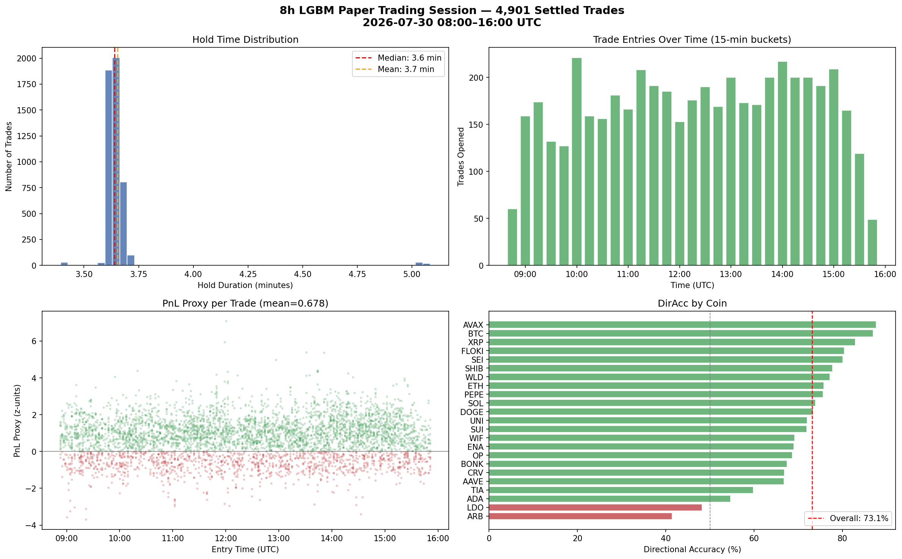

# StatArb Cross-Venue Spread Model — Strategy Overview

**Prepared for:** Ke Li  
**Authors:** Kevin Litvin, Tania Pocrnjic  
**Date:** 2026-07-30

---

## 1. What the Model Predicts

We predict **z_{t+2}** — the z-score of the cross-exchange spread, 2 snapshots (~3.6 minutes) into the future.

### Z-Score Computation

For each `(coin, pair)` — e.g. BTC on `binance__okx` — the spread in basis points is computed at every snapshot. The z-score normalizes this spread using a **rolling window of 120 snapshots** (with a minimum of 30 observations before producing a value):

$$z_t = \frac{\text{spread\_bps}_t - \mu_{120}}{\sigma_{120}}$$

Where $\mu_{120}$ and $\sigma_{120}$ are the rolling mean and standard deviation of `spread_bps` over the last 120 snapshots for that specific coin–pair. At the designed 60-second cadence, this window would cover **2 hours**; in practice, API latency stretched each snapshot to ~110 seconds, so the window covered roughly **3.7 hours** during the live session.

The model's target is: **what will $z$ be 2 snapshots from now?**

---

## 2. Model Architecture

- **Algorithm:** LightGBM (gradient-boosted trees)
- **Features:** 73 total, including:
  - Spread z-score lags (z_{t-1}, z_{t-2})
  - Ticker data (bid/ask/last across venues)
  - Order book features (depth, slippage)
  - Trade flow features
  - Cross-exchange statistics (dispersion, rank, imbalance)
- **Coins:** 23 volatile cryptocurrencies
- **Venues:** 6 CEXs (Binance, Bybit, OKX, Coinbase, Kraken, MEXC)
- **Pairs:** Every combination of 2 venues per coin → up to ~300 predictions per snapshot

---

## 3. Entry Filter: `|pred| >= 0.5`

The model produces a prediction for **every** (coin, pair) at every snapshot. However, we only open a paper trade when the model is confident:

> **Entry rule:** open a position when `|pred| >= 0.5`

This means the model predicts the future z-score will be at least 0.5 standard deviations away from the mean. Over the 8-hour campaign:

| Stage | Count |
|---|---|
| Total predictions generated | **80,040** |
| Predictions retained for scoring | **49,310** |
| Predictions passing `\|pred\| >= 0.5` (entries) | **5,054** |
| Bets that settled within the session | **4,901** |

The filter reduces the prediction universe by ~90%, selecting only the highest-conviction signals.

---

## 4. Kevin's Paper Trading Campaign (8 Hours Live)

**Date:** 2026-07-30, 08:00–16:00 UTC (unattended)  
**Model:** `statarb/outputs_ob_fix/statarb_lgbm.txt`

### Session Summary

| Metric | Value |
|---|---|
| Duration | 8 hours |
| Snapshots collected | 264 |
| Hold time per trade | ~3.6 minutes (fixed 2-snapshot horizon) |
| Total predictions | 80,040 |
| Entries opened | 5,054 |
| Bets settled | 4,901 |
| Settled Directional Accuracy | **73.1%** |
| Mean PnL proxy | **+0.678 z-units** |

### Model vs Naive Persistence Baseline

The **naive baseline** simply predicts $z_{t+2} = z_t$ — "the spread stays where it is."  
Both are scored on **identical rows** so the comparison is fair.

| Rows | Model R² | Model DirAcc | Naive R² | Naive DirAcc | Model Edge |
|---|---|---|---|---|---|
| All predictions (49,310) | +0.054 | 55.3% | −0.547 | **62.3%** | −7.0pp |
| Entries `\|pred\| >= 0.5` (5,054) | **+0.248** | **76.5%** | −0.045 | 75.4% | **+1.1pp** |

### What "+1.1pp DirAcc" Means

**pp = percentage points.** On the filtered entry rows, the model predicts the correct direction 76.5% of the time, while naive persistence gets 75.4%. The difference is 76.5% − 75.4% = **1.1 percentage points**. This is the model's genuine directional edge over simply saying "z stays the same" — after removing the selection bias from the `|pred| >= 0.5` filter.

### Key Insight

The `|pred| >= 0.5` filter selects rows where z is already extreme. On those rows, *any* predictor (even naive) gets ~75% direction accuracy for free because large z-scores tend to persist. The model's true incremental skill on direction is small (+1.1pp), but its magnitude predictions (R² = 0.248 vs −0.045) are substantially better than naive.

---

## 5. Trade Visualizations (Kevin's 8h Session)

**Top-left:** Hold time distribution — nearly all trades held for exactly ~3.6 minutes (2 snapshots × ~110s each).  
**Top-right:** Trade entries over time — steady flow of ~150–220 entries per 15-minute bucket across the session.  
**Bottom-left:** PnL proxy per trade — slight positive skew, mean +0.678 z-units.  
**Bottom-right:** Directional accuracy by coin — most coins 60–85%, with ARB and LDO underperforming.

---

## 6. Tania's Backtesting Results (Current Best)

Tania's model variant currently holds the strongest offline backtesting performance:

| Metric | Value |
|---|---|
| R² | **~10%** (0.10) |
| Directional Accuracy | **~60%** |
| Entry filter | **None** — all predictions scored without `\|pred\|` thresholding |

Because Tania's model does not apply a `|pred| > 0.5` filter, its metrics reflect full-population performance rather than a filtered subset. This makes the 10% R² and 60% DirAcc directly comparable to Kevin's "all predictions" row (R² = 0.054, DirAcc = 55.3%) — representing a significant improvement.

---

## 7. Literature Review — How We Compare

Peer-reviewed and preprint literature gives useful benchmarks for judging whether our R² / DirAcc numbers are reasonable, low, or high for this problem class.

### General financial return prediction

Out-of-sample R² for continuous return regression is expected to be **near zero** — typically 0.01%–1% (0.0001–0.01) — because daily/high-frequency returns are dominated by noise. Values above ~0.4–0.5 in a live setting almost always signal overfitting or leakage, not skill. A tiny positive R² can still be profitable if compounded over many trades; DirAcc of **51–54%** is often considered viable for single-asset direction.

### Crypto-specific factor & ML studies

- **Machine Learning and the Cross-Section of Cryptocurrency Returns** — high-dimensional factor models (incl. gradient-boosted trees, random forests, NNs) applied to crypto assets report out-of-sample R² around **0.3%–2.75%**, yet still produce long-short portfolios with strong Sharpe ratios (reported as high as 5.37). This is the standard "low R², profitable anyway" pattern.
- **CryptoMamba: Leveraging State Space Models for Accurate Bitcoin Price Prediction** ([arXiv:2501.01010](https://arxiv.org/abs/2501.01010)) — a Mamba-based SSM shown to generalize better than LSTMs across regimes for BTC price forecasting; representative of the shift away from ARIMA/LSTM toward newer sequence architectures.
- Three-class trend-classification papers (positive / near-zero / negative next-day return, via XGBoost/RF/SVM) report **>60% classification accuracy** on BTC/ETH/SOL, but note asymmetric precision — positive-return predictions are less reliable than the headline accuracy suggests.
- A recurring "complexity penalty" is noted across surveys: simple models often out-generalize deep architectures once tested out-of-sample, because complex models overfit structural breaks unique to backtest windows.

### Spread / stat-arb specific benchmarks

This is the most relevant category for our strategy, since we trade a **cross-venue spread**, not a raw asset price:

| Strategy type | Typical out-of-sample DirAcc | Notes |
|---|---|---|
| Statistical arbitrage / pairs trading (mean-reverting) | **53%–58%** | Profitability comes from asymmetric payoffs (cut losers fast), not high hit rate |
| High-frequency market making / cross-exchange spread | **65%–85%** | Relies on volume, rebates, and low latency; high accuracy on very short horizons |

Literature also stresses **conditional DirAcc**: accuracy should be measured specifically at spread extremes (e.g., `|z| > 2.5`), since that is where mean-reversion structurally raises the odds of a correct call — exactly the effect we observe with our `|pred| >= 0.5` filter.

### How our numbers stack up

| Metric | Our result (Kevin, filtered) | Our result (Kevin, unfiltered) | Tania (backtest, unfiltered) | Literature range |
|---|---|---|---|---|
| R² | +0.248 | +0.054 | ~0.10 | 0.0001–0.03 (general/factor models) |
| DirAcc | 76.5% (73.1% settled) | 55.3% | ~60% | 53–58% (stat-arb) / 65–85% (HF market-making) |

**Takeaway:** our unfiltered R² (0.054) and Tania's (0.10) both sit **above** typical crypto factor-model benchmarks (0.003–0.0275), which is a good sign, though the literature's warning about the "backtest vs. live gap" is exactly why we are validating Tania's model live next. Our filtered DirAcc (76.5%) falls inside the HF market-making band, but — matching the literature's caution about conditional accuracy at extremes — most of that lift is the entry filter selecting easy rows, not incremental model skill (see the +1.1pp naive comparison in Section 4). Our unfiltered DirAcc (55.3%) is below the stat-arb range (53–58% floor) and well below naive persistence (62.3%) on the same rows, meaning direction alone is not currently a source of edge — the genuine signal is in magnitude (R²), consistent with how the literature treats gradient-boosted trees as strong at capturing non-linear factor structure without necessarily beating a naive directional baseline.

---

## 8. Next Steps (Next 2 Days)

1. **Paper-trade Tania's model live** — deploy her stronger backtest variant in the same 8h live framework to validate that the offline 10% R² / 60% DirAcc holds in production without the entry filter.
2. Compare full-population metrics head-to-head (Kevin's 5.4% R² vs Tania's expected 10%).
3. If validated, add fee/slippage modeling to convert z-unit PnL proxy into dollar estimates.

---

## Glossary

| Term | Definition |
|---|---|
| **R²** | Coefficient of determination. Measures how much variance in the realized z_{t+2} is explained by the prediction. 0 = no better than guessing the mean; 1 = perfect. |
| **DirAcc** | Directional Accuracy. Fraction of predictions where sign(pred) = sign(realized). 50% = coin flip. |
| **pp** | Percentage points. An absolute difference between two percentages (76.5% − 75.4% = 1.1pp). |
| **Naive persistence** | Baseline that predicts "z won't change": $\hat{z}_{t+2} = z_t$. |
| **PnL proxy** | `sign(pred) × realized_z` in z-units. Positive when model direction was correct. Not dollars. |
| **Entry filter** | Only act when `\|pred\| >= 0.5`. Reduces noise trades but introduces selection bias. |
