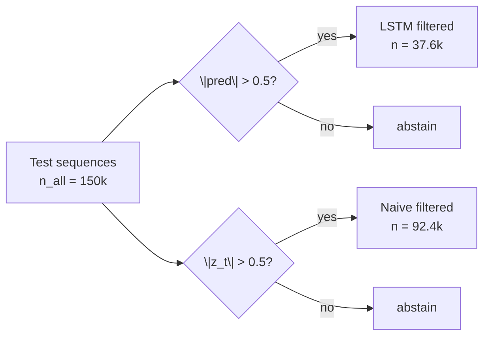

# LSTM Z-Score Metrics (size-matched)

Protocol: predict `z_(t+1)` with W=300, min_periods=90, SEQ_LEN=64, `hidden=160` (~LGBM size).  
**Primary slice:** `|pred| > 0.5` (same filter axis as LGBM campaigns).  
Split: train &lt; Jul 25 / test Jul 25–28 (`snapshot_idx` cut 3584).  
Panel: stride/subsampled test sequences → **n_all = 150,000** (not the full Jul25 row set).

Features are **LSTM-native** (pair-leg microstructure sequences), not the 68 LGBM columns.

---

## Why filtered `n` differs (LSTM vs naive)

Both rows below are scored on the **same 150k** test sequences. The filters are **different**:

| Slice | Filter | n | Fire rate |
|---|---|---:|---:|
| LSTM filtered | `\|pred_LSTM\| > 0.5` | **37,601** | 25.1% |
| Naive filtered | `\|z_t\| > 0.5` | **92,412** | 61.6% |
| All (both) | none | 150,000 | 100% |

Naive fires more often because many rows have `|z_t| > 0.5` while the LSTM prediction stays inside `(-0.5, 0.5)`.  
Smaller LSTM `n` is **expected abstention**, not a missing data bug.

**Selection / confidence concern:** yes — `|pred|>0.5` keeps higher-confidence forecasts, which lifts *conditional* DirAcc / R² / mean pnl. That is the intended filter design (same as LGBM campaigns). Mitigations reported below: (1) **all-row** metrics, (2) naive under **its own** `|z|>0.5` filter, (3) **total** pnl_proxy = mean × n so a thin book cannot hide behind mean alone.

---

## Headline — LSTM vs naive (same 150k panel)

Rounded for reading; exact floats in `metrics.json`.

| Model | Filter | n | DirAcc | R² | mean pnl_proxy | **total pnl_proxy** | Sharpe/trade | Sharpe A |
|---|---|---:|---:|---:|---:|---:|---:|---:|
| **LSTM** | `\|pred\| > 0.5` | 37,601 | **81.6%** | **0.470** | **+0.816** | +30,671 | 0.83 | 3.93 |
| Naive `z_t` | `\|z_t\| > 0.5` | 92,412 | 70.5% | −0.281 | +0.483 | **+44,614** | 0.48 | 4.55 |
| LSTM | all | 150,000 | 67.4% | 0.229 | +0.363 | +54,421 | 0.38 | 4.77 |
| Naive `z_t` | all | 150,000 | 69.3% | −0.206 | +0.340 | +50,958 | 0.35 | 4.62 |

`total pnl_proxy = mean_pnl_proxy × n` (sum of z-settled proxies on that slice).

**How to read this:**
- On **conditional** skill (DirAcc / R² / mean pnl), filtered LSTM beats filtered naive.
- On **total** z-proxy mass, filtered naive is higher because it trades ~2.5× more rows — selection helps means, not automatically total PnL.
- On **all rows** (no filter), LSTM still beats naive on R² and mean/total pnl_proxy; DirAcc is slightly below naive (67.4% vs 69.3%).

Exact table (unrounded):

| Model | n | DirAcc | R2 | mean pnl_proxy | Sharpe (per-trade) | Sharpe A (closed hourly) |
|---|---:|---:|---:|---:|---:|---:|
| LSTM | 37601 | 0.8158559612776256 | 0.4697818177777725 | 0.815693115434002 | 0.834517884549893 | 3.9336042118956773 |
| Naive z_t | 92412 | 0.704572999177596 | -0.2813243158016343 | 0.4827753293485979 | 0.48252890179985 | 4.545413271384821 |

Definitions:
- `pnl_proxy = sign(pred) * z_(t+1)` (for naive, `pred := z_t`)
- DirAcc / R² / mean pnl_proxy on the stated filter slice
- `sharpe_per_trade = mean(pnl_proxy) / std(pnl_proxy)` (Rf=0)
- `sharpe_closed_hourly_A` = mean/std of summed filtered pnl_proxy per `(window_id, snapshot_idx//33)` — offline closed-only; **not** live Sharpe B

---

## Full slices

### LSTM
- All: n=150000, DirAcc=67.42%, R2=0.2288, mean_pnl_proxy=0.3628, sharpe_per_trade=0.3773, sharpe_closed_hourly_A=4.7738
- Filtered: n=37601, DirAcc=81.59%, R2=0.4698, mean_pnl_proxy=0.8157, sharpe_per_trade=0.8345, sharpe_closed_hourly_A=3.9336

### Naive z_t → z_(t+1)
- All: n=150000, DirAcc=69.29%, R2=-0.2064, mean_pnl_proxy=0.3397, sharpe_per_trade=0.3502, sharpe_closed_hourly_A=4.6235
- Filtered: n=92412, DirAcc=70.46%, R2=-0.2813, mean_pnl_proxy=0.4828, sharpe_per_trade=0.4825, sharpe_closed_hourly_A=4.5454

---

## Literature adaptations

- **Tsoku & Makatjane (2026):** MSE regression of standardized spread/z; report forecast + trading metrics.
- **Han & Li (2024):** PyTorch LSTM; `|pred|>0.5` as trade abstention filter (not their 3-class trend head).
- **Sheng & Ma (2022)** (repo notes mis-cite as Shen): 2-layer LSTM + Adam; dual error/trading table.

## Artifacts

- `statarb_lstm.pt`
- `feature_schema.json`
- `metrics.json`
- `model_size_report.json`
